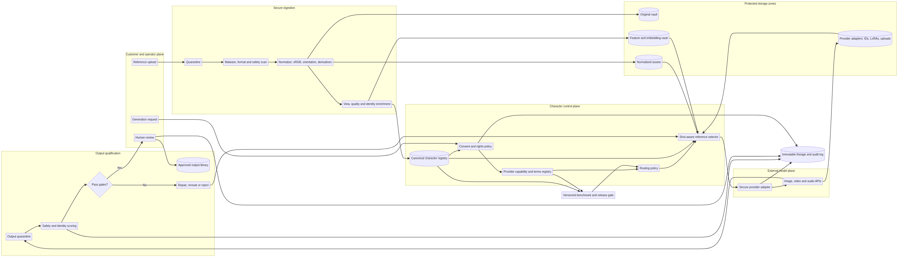

# Preserving Character Identity Across Repeated Image and Video Generation

## Evidence-based reference-asset, model-routing, validation, and SaaS architecture specification

**Research cut-off:** 3 August 2026  
**Author:** Manus AI  
**Scope:** Current image/video generation models and APIs, subject-conditioning research, production workflow design, identity-drift testing, and defensible SaaS claims

> **Legal review notice:** I’m an AI, not a lawyer. The governance and claims sections are privacy-by-design technical and product recommendations, not formal legal advice. Qualified counsel should review consent, likeness/publicity rights, biometric-data treatment, minors, retention, vendor contracts, and customer-facing wording before launch.

## Executive summary

The platform should define a character once as a **provider-independent, versioned identity package**, then compile that package into the smallest coherent set of controls supported by each model. A provider upload, character ID, embedding, LoRA, or fine-tune is a derived adapter—not the canonical identity.

The canonical standard should contain **eight separate identity stills**, not only one multi-angle sheet: frontal face, left and right three-quarter face, profile face, full-body front, full-body three-quarter, full-body side, and full-body rear. A three-image minimum—front face, three-quarter face, and full-body front—can support onboarding, but it should carry a weaker consistency claim. Expressions, hairstyles, outfits, accessories, poses, styles, environments, voice, and motion belong in separate versioned modules. Luma’s current guidance explicitly recommends one angle per image in its workflow because multi-angle sheets can introduce artifacts; Kling and Runway likewise expose multi-view or multi-reference controls.[1] [2] [3]

Store byte-exact originals, then create normalized **sRGB, 8-bit, opaque PNG masters** at a recommended 2048-pixel long edge. PNG is an archival engineering choice, not a proven identity advantage over a visually equivalent high-quality JPEG. Provider derivatives should use whatever accepted format minimizes payload without perceptible loss. Keep segmentation masks separate; do not make transparency part of the identity master.

For stills, select references by shot angle and framing, keep identity independent from wardrobe and style, generate several candidates, and score every candidate before approval. For video, begin with an identity-approved hero frame or registered character asset, generate short single-beat shots, provide first/last frames or timestamped keyframes where supported, and evaluate the clip frame by frame. Every independent shot and retry should re-anchor to the master package; generated derivatives must not silently replace it.

No reviewed model justifies a universal “best” ranking. The leading **control surfaces** are currently: Gemini 3 image models, GPT Image 2, FLUX.2, Runway Gen-4 Image, and Kling Elements for stills; Veo 3.1, Gemini Omni Flash, Sora character assets for eligible subjects, Kling Elements, MiniMax H3, Runway Gen-4.5/Act-Two/Aleph 2.0, and Luma Ray 3.2 for different video workflows. Midjourney and Pika remain useful for concepting or bounded animation, but their documented controls are weaker for a cross-shot persistence promise. These are integration recommendations derived from documented controls, **not results from a controlled visual benchmark**.

Identity drift should be measured as a vector: face fidelity, global subject identity, body proportions, hair, wardrobe, critical accessories/markings, prompt/pose adherence, temporal consistency, cross-shot continuity, and technical quality. Any unexplained identity swap is a hard failure regardless of the average score. Face embeddings such as ArcFace or AdaFace can contribute, but thresholds must be calibrated against human labels on the platform’s own character distribution and must be examined by demographic and visual-style slice.[15] [16] [17] [30] [31]

The product can credibly promise a **reference-anchored, tested consistency workflow**: it reuses an approved character definition, selects compatible controls, evaluates drift, and rejects or flags nonconforming outputs. It should not promise “perfect,” “identical in every frame,” “zero drift,” “biometrically identical,” or “100% consistent.”

### Recommended decision set

| Decision | Recommendation | Confidence |
|---|---|---|
| Canonical package | Eight separate identity stills; three-image minimum tier; optional short multi-angle video | Strong design synthesis; exact count requires product benchmark |
| Multi-angle sheet | Derivative only, never the sole source; use only when a one-image model benefits in testing | High |
| Runtime reference count | Select 1–5 coherent, shot-relevant views in most workflows; never fill all slots merely because they exist | Strong inference; model-specific optimum unknown |
| Identity versus outfit/style | Store and condition separately | High |
| File format | Preserve original; normalize to opaque sRGB PNG; generate JPEG/WebP provider copies as needed | High engineering confidence; no intrinsic PNG identity advantage established |
| Image workflow | Native character/multi-reference control → tuning-free adapter → fine-tune → localized repair | High |
| Video workflow | Approved hero frame/character asset → short shot → keyframes/performance controls → frame-level gate | High |
| Fine-tuning | Escalate persistent characters to a version-pinned LoRA or comparable subject tune after zero-shot failure | Medium-high; model-dependent |
| Identity metric | Multi-axis automatic score plus human adjudication; no universal cosine cutoff | High |
| Customer promise | Guarantee the controlled process and approved-output gate, not every raw stochastic generation | High |

## 1. Evidence boundaries and confidence

This report distinguishes **documented capability**, **primary research**, **vendor claim**, **practitioner observation**, and **analyst recommendation**. Official API documentation is authoritative for current input fields and limits, but it does not prove comparative output quality. Original papers establish mechanisms under specific models and datasets, but not automatic production superiority. Practitioner reports can expose failure modes but are not controlled benchmarks.

The conclusions are current to 3 August 2026. Provider model aliases, terms, limits, moderation and retention can change quickly. Before launch, every enabled model must pass the release benchmark described in Section 8, and any subsequent model change must enter shadow or canary evaluation before becoming the default.

No real-output benchmark was run for this report because a defensible benchmark requires a consent-cleared cast, target creative scenarios, provider credentials, a generation budget, and human labels. The model tables therefore rank **control suitability**, not visual quality.

## 2. Standard character reference-asset specification

### 2.1 Canonical package: eight identity stills

The system should store each view as a separate asset. A contact sheet can be rendered later for display or for a model proven to prefer a collage, but preserving individual sources prevents baked-in labels, panel borders, duplicated limbs, mismatched scale, and cross-panel leakage.

| Asset role | Framing and capture | Information supplied | Typical use |
|---|---|---|---|
| `identity.face.front` | Head and shoulders, frontal, neutral, entire hair and chin visible | Primary facial geometry, eye spacing, mouth, jaw, hairline | All face-led shots |
| `identity.face.three-quarter-left` | Head and shoulders, 30–45° left yaw | Left cheek, ear, nose projection, hair depth | Left-oblique shots and general depth |
| `identity.face.three-quarter-right` | Mirrored three-quarter view | Bilateral asymmetry and opposite-side details | Right-oblique shots |
| `identity.face.profile` | Clean left or right profile | Nose/chin silhouette, skull, ear and hairstyle depth | Profile and large-yaw shots |
| `identity.body.front` | Full body, relaxed A-pose, hands and feet visible | Height ratio, shoulder/hip width, limbs and baseline silhouette | Full- and medium-body shots |
| `identity.body.three-quarter` | Full body, 30–45° yaw | Torso volume, body depth and garment drape | Oblique and action shots |
| `identity.body.side` | Full-body profile | Posture, abdomen/back contour and limb depth | Lateral movement and turns |
| `identity.body.rear` | Full body from rear | Back of hair, shoulder/back geometry and rear accessories | Rear, over-shoulder and turnaround shots |

The number eight is a **platform design standard**, not a vendor-mandated optimum. It provides enough geometric coverage for future model routing while keeping onboarding manageable. Luma’s reference guidance emphasizes that unseen angles force the model to invent geometry and specifically recommends separate angles in its workflow.[1] Kling builds a character Element from a main image plus supplemental views, and Runway accepts multiple references.[2] [3]

### 2.2 Tiers

| Tier | Required assets | Appropriate product wording |
|---|---|---|
| Basic | Front face, three-quarter face, full-body front | “Improves continuity in common frontal and three-quarter shots” |
| Standard | Eight-view package | “Production reference package for model-qualified multi-shot workflows” |
| Enhanced | Standard pack plus opposite profile, critical-detail assets and a 3–8 second reference turn | “Strongest available input package; output still subject to qualification” |
| Fine-tuned | Curated approved training subset plus version-pinned adapter/LoRA | “Persistent model-specific character profile” with explicit model/version scope |

A three-image Basic pack should not underpin a claim about rear, profile, extreme-angle or complex full-body continuity. A four-view runtime subset—front, three-quarter, profile and full body—maps naturally to Kling’s documented multi-image Element workflow, but the canonical repository should remain richer.[2]

### 2.3 Keep mutable controls separate

A reference image often carries more than identity: outfit, pose, background, lighting and visual style. General image encoders may reproduce all of these, which creates the false impression that stronger identity conditioning is always better. In practice, identity strength competes with editability. IP-Adapter separates text and image conditioning through decoupled cross-attention; Runway encourages separate reference pathways; Adobe exposes structure and style reference controls; and Luma Ray 3.2 exposes distinct face, body, pose, motion and structure locks.[3] [8] [9] [10]

| Module | Store | Do not silently bind |
|---|---|---|
| Identity | Stable face geometry, skin/marking pattern, ears, eye shape, hairline, stable body proportions | Outfit, pose, scene or rendering style |
| Hairstyle | Cut, length, texture, parting, colour, rear shape | Core face geometry |
| Wardrobe | One approved outfit version, footwear and garment-specific accessories | Permanent identity unless intentionally inseparable |
| Signature accessories | Glasses, jewellery, prosthetics, tattoos, logos, props | General composition |
| Expression/performance | Neutral, smile, speech, intense expression or driving video | Baseline facial structure |
| Pose/blocking | Skeleton, body pose, hands and gaze | Identity or wardrobe |
| Style/lighting | Medium, texture, palette, cinematography | Character content |
| Scene | Environment, set, background and time of day | Subject identity |
| Voice | Consent-cleared voice asset or provider voice ID | Visual identity unless a provider explicitly binds them |

Each property should be marked **locked**, **preferred**, or **mutable**. Hair, age presentation, makeup, body type and wardrobe are not universally immutable or editable; that decision belongs in the approved character definition.

### 2.4 Expressions, outfits, accessories and voice

Store expression images separately rather than as one dense expression sheet. A practical optional set is neutral, natural smile, speech/open-mouth, and one high-intensity expression relevant to the character. For dialogue video, a clean driving performance is more informative than a collage; Runway Act-Two, for example, accepts a performance video and a character image/video as distinct inputs.[11]

Each outfit should have a `wardrobe_id` and, where important, front, three-quarter, rear and detail views. Maintain a face-led identity source free from outfit dependence. Midjourney’s current Omni Reference offers one overall weight and explicitly warns that intricate details may not match, illustrating why small logos, freckles, tattoos, jewellery and patterned fabric require explicit validation or post-editing.[12]

Voice requires a separate consent record, evaluation method and retention policy. Do not infer permission to clone or synthesize a voice from permission to use an image.

### 2.5 Capture conditions

The default identity background should be **plain, matte, neutral light grey**. White is acceptable when contrast is sufficient, but grey better preserves separation for white clothing and light hair. Lighting should be diffuse, frontal or slightly off-axis, with accurate white balance and no clipping. Use a normal-to-short-telephoto perspective for human faces; avoid wide-angle distortion.

Reject or flag heavy beauty filters, sunglasses, hats or masks that hide locked features, severe depth-of-field blur, motion blur, strong coloured gels, dramatic rim light, multiple faces, clipped hair/chin/hands/feet, environmental objects overlapping the silhouette, and near-duplicate views. Store environmental examples separately for scene/style control.

### 2.6 Format, dimensions and colour

| Property | Canonical master | Provider derivative |
|---|---|---|
| Original | Preserve byte-exact upload | Never submit unless explicitly selected |
| Format | PNG, 8-bit RGB, lossless | PNG by default; high-quality JPEG/WebP where accepted and materially smaller |
| Colour | sRGB IEC 61966-2-1 | sRGB |
| Alpha | Opaque identity image; mask stored separately | Opaque unless a specific edit endpoint requires transparency |
| Orientation | Physically rotate pixels and normalize EXIF | Same |
| Metadata | Preserve provenance internally; strip unnecessary EXIF/GPS from delivery copies | Minimum required |
| Resolution | Recommended 2048-pixel long edge; retain higher-resolution original | Resize for endpoint and target shot; do not blindly upscale poor input |
| File size | Internal quality-first storage | Conservative target under 10 MB per still for broad compatibility |

Current providers accept overlapping but non-identical formats and dimensions. Kling documents JPEG/PNG references up to 10 MB with minimum dimensions and aspect bounds; MiniMax accepts broader reference dimensions and up to 30 MB; Sora requires a first-frame image to match the requested video resolution.[5] [7] [14] The delivery adapter must therefore transform only after it knows the target endpoint.

There is no reviewed controlled evidence that PNG intrinsically preserves generated identity better than a visually indistinguishable high-quality JPEG. PNG is recommended because it avoids cumulative recompression and gives the system a stable source for hashing and derivatives. WebP is useful for transport but should not be the only stored master.

Recommended normalized canvases are 2048 × 2048 for face close-ups, 2048 × 2560 for portraits, and 2048 × 3072 or 2304 × 3072 for full-body views. Keep the full silhouette and modest margin. These are platform defaults, not universal API constraints.

### 2.7 Optional short reference video

The Enhanced pack should include an optional **3–8 second** single-character clip with neutral lighting, a static or gently moving camera, and a slow head/body turn revealing frontal, three-quarter and profile geometry. Kling documents 3–8 seconds for video character elements, while Sora recommends short source clips for character assets and asks developers to match source and output aspect ratios.[2] [5]

Retain the consent-cleared source and create provider-specific trims. A reference video should not be assumed to serve visual identity, motion and voice equally well.

## 3. SaaS storage, processing and runtime selection

### 3.1 Core architecture

The platform should own a tenant-scoped `character`, an immutable `character_version`, its `reference_assets`, `wardrobe_versions`, `accessory_definitions`, `voice_assets`, `consent_records`, and a set of `provider_adapters`. Every generation request must point to exact versions. Correcting a reference or changing a locked trait creates a new version rather than mutating history.

| Storage zone | Contents | Required posture |
|---|---|---|
| Upload quarantine | Untrusted originals before validation | No public serving; malware/format scan; short-lived |
| Original vault | Byte-exact sources and consent evidence | Strongest access controls; tenant-scoped encryption where feasible |
| Normalized asset store | PNG masters, video derivatives, masks and thumbnails | Private objects; short-lived signed URLs |
| Feature vault | Face/body embeddings and quality features | Separate key policy; server-only; high-sensitivity audit |
| Provider-adapter vault | Character IDs, upload handles, embeddings, LoRAs/fine-tunes | Provider/model-scoped and revocable |
| Output quarantine | Unreviewed raw results | Not customer-shareable until safety and identity checks pass |
| Approved library | Accepted customer assets | Tenant ACL, lineage and retention policy |
| Audit store | Decisions, hashes, disclosure records and model versions | Append-only or tamper-evident; minimize raw likeness data |

Embeddings and fine-tuned weights should be handled as sensitive derived identity data even where a particular jurisdiction may not label them regulated biometrics. They are hard to rotate and can facilitate recognition or reconstruction.

### 3.2 Ingestion pipeline

The state flow should be `uploaded → scanned → normalized → enriched → consent-verified → approved → provider-eligible`. Server-side checks must validate type, bytes, dimensions, duration, decompression risk, malware, content policy, face count, view, blur, exposure, crop completeness, duplicates and cross-view identity. Client-supplied labels are claims, not truth.

The system should link a valid purpose-bound consent record before a character becomes selectable. Voice authorization is separate. Public figures, children or age-ambiguous subjects, non-consensual intimate content, and high-risk impersonation require conservative product policy and specialist review; automated age or celebrity detection must not be the sole decision-maker.

### 3.3 Shot-aware selector

For every generation, resolve the character, outfit, hair, accessories, expression, pose, style and scene. Classify the shot, then rank references by view match, quality and information diversity while penalizing near-duplicates and contradictions.

| Requested shot | Preferred reference subset |
|---|---|
| Frontal close-up | Front face + matching three-quarter |
| Three-quarter portrait | Matching three-quarter + front face + optional full-body front |
| Profile | Profile + nearest three-quarter + front face |
| Full-body action | Full-body front + three-quarter + side + front face if capacity permits |
| Rear/turn | Rear body + side + three-quarter; approved start/end frames where supported |
| Outfit change | Face-led identity references + target wardrobe; exclude old-outfit-heavy identity images |
| Stylized render | Two clean face/body identity views + separate style input at calibrated strength |
| Dialogue video | Approved hero still or character asset + driving performance; moderate motion |

Stop adding references when marginal information gain is low. A provider’s maximum is a capacity limit, not a target. When a model accepts only one identity image, send a purpose-built hero image matched to the shot rather than a generic collage unless a controlled ablation demonstrates the collage performs better.

### 3.4 Provider registry and disclosure

Maintain a centrally governed registry with exact model/snapshot, modalities, identity controls, reference limits, formats, human-likeness policy, region, retention, moderation, terms version, benchmark status and effective date. Features should request semantic capabilities such as `MULTI_REFERENCE_STILL`, `REGISTERED_CHARACTER_VIDEO`, `PERFORMANCE_TRANSFER`, or `VIDEO_EDIT_KEYFRAMES` rather than hardcode model names.

Immediately before submission, recheck consent and policy, generate endpoint-specific copies, submit through a server-side adapter with idempotency, timeout, retry and circuit breaker controls, and record exactly what was disclosed. Delete ephemeral outbound copies after the defined workflow window.

OpenAI currently states that API data is not used to train its models unless a customer opts in, while default abuse-monitoring retention and endpoint-specific application state can apply. Its image endpoints are listed as eligible for Zero Data Retention, whereas its video endpoint is not and has a distinct processing/download and abuse-monitoring lifecycle.[32] Google’s current Gemini terms distinguish unpaid services—which may use and human-review submitted content—from paid services, for which prompts and responses are not used to improve products and are processed under applicable data-processing terms.[33] Production likeness workflows should therefore use reviewed paid or enterprise configurations, never assume one vendor policy covers every endpoint, and retain a terms snapshot.

### 3.5 Output states and deletion

A raw provider output enters quarantine. Automatic checks determine whether it is rejected, sent for human review, repaired or approved. An approved shot may be used as a **shot continuity reference**, but it cannot replace the canonical character without an explicit new `character_version`.

Consent revocation should immediately block new work, cancel queued jobs where possible, revoke URLs, delete normalized assets and embeddings under policy, call provider deletion endpoints, clear caches and adapters, and retain only minimum audit evidence. Provider safety/log retention may outlive local deletion; product copy and contracts must explain that distinction.

Attach or preserve C2PA Content Credentials where supported. C2PA records source and edit history; it does not establish visual fidelity, truth or consent, so it complements rather than replaces internal lineage and approval.[34]

## 4. Image-generation workflow

### 4.1 Identity mechanism ladder

| Priority | Mechanism | Use case | Trade-off |
|---|---|---|---|
| 1 | Native reusable character/Element ID | Provider supports persistent asset and subject is eligible | Strong vendor lock-in and policy scope |
| 2 | Native multi-reference generation/editing | Fast onboarding and broad API support | Reference fusion/weighting may be opaque |
| 3 | Tuning-free adapter | Self-hosted or API stack supports PuLID, InstantID or IP-Adapter | Identity strength can reduce editability |
| 4 | Version-pinned LoRA/DreamBooth-style tune | High-value recurring character fails zero-shot gates | Training cost, overfitting, base-model coupling and deletion burden |
| 5 | Localized repair/compositing | One region drifts after composition succeeds | Seams, additional QC and provenance complexity |

DreamBooth demonstrated subject binding from a small per-subject set, while IP-Adapter, InstantID and PuLID provide tuning-free identity conditioning with different identity/editability trade-offs.[18] [8] [19] [20] Fine-tuning is therefore an escalation path, not the first onboarding step.

### 4.2 Request compilation

Compose independent blocks for identity, wardrobe, pose/action, camera/scene, style and lighting. Keep the immutable identity block concise; do not redundantly describe every visible facial detail unless the text must disambiguate a locked trait. Contradictory prose can compete with the image.

Provider weights are not portable. Midjourney’s Omni weight is 1–1000 and warns that very high values can be unpredictable; Adobe structure strength is 1–100; older Kling models expose face-fidelity controls; Luma uses separate 1–9 motion and structure adherence.[10] [12] [14] Calibrate defaults per endpoint and hide raw values behind product semantics such as “loose,” “balanced,” and “strict” only after testing.

For FLUX.2, identify each input image explicitly and put the primary subject and action early because the official guide says word order matters and the model does not use negative prompts.[6] [21]

### 4.3 Generate, score, edit and escalate

Generate multiple candidates from the same compiled request. Reject wrong character count, face loss, identity collision, unapproved outfit, missing mandatory accessories, unsafe content or severe artifacts before showing results. Rank the remainder with the drift framework; a human approves production assets.

If an output is close, edit only the failing region rather than regenerate everything. OpenAI supports iterative image editing, Runway encourages element-by-element reference workflows, FLUX.2 supports multi-reference editing, and Adobe exposes structure/style controls.[3] [6] [9] [13] Re-submit or retain the master identity controls during repair whenever possible.

Escalate to a model-specific fine-tune when a character repeatedly fails a predefined cross-angle/style suite after reasonable zero-shot attempts. Curate diverse approved images, remove duplicates and backgrounds/wardrobes that should not be learned as identity, pin the base model, and treat any base-model migration as a new benchmark and often a new adapter.

## 5. Video-generation workflow

Video adds temporal correspondence, motion, occlusion and re-identification risk. A model can match the first frame and still drift after a turn, lighting change, cut, rapid expression or exit/re-entry.

### 5.1 Approve a hero frame first

Create or select an identity-approved still that matches the planned opening composition, active wardrobe and lighting. Image-to-video from an approved frame is generally more controllable than unconstrained text-to-video because appearance and composition begin anchored. Sora, Midjourney Video, Veo, Runway and MiniMax all provide first-frame or I2V modes, although their persistent character controls differ.[5] [7] [22] [23] [24]

For a scene with several shots, approve all hero stills as a continuity set before animating them. Do not ask the video model to discover the cast design and performance simultaneously when identity is contractual.

### 5.2 Select the correct mode

| Mode | Best use | Identity strategy |
|---|---|---|
| Reusable character-to-video | Repeated mascot or supported character asset | Provider character ID on every call; respect human-likeness policy |
| Reference-to-video | New scenes with known subjects | Re-submit approved views or Elements every generation |
| Image-to-video | Animate an approved still | Hero frame carries identity; keep initial motion modest |
| First-and-last-frame | Turn, controlled transition, camera move | Both anchors must show the same approved character/version |
| Performance transfer | Dialogue, acting and gesture | Appearance input separate from driving performance |
| Video-to-video | Preserve timing, camera and performance | Source clip plus face/body/structure locks and keyframes |
| Extension | Continue an approved shot | Extend only after the current segment passes; do not extend drift |
| Timestamped keyframe editing | Repair or art-direct moments | Insert approved identity frames at drift-prone timestamps |

Runway Act-Two illustrates appearance–motion separation: a driving performance supplies motion/expression, while a character image enables gesture transfer and a character video preserves source camera/body motion.[11] Luma Ray 3.2 transforms existing video, accepts up to 64 keyframes, and exposes separate face, body, pose/blocking, motion and structure controls.[10]

### 5.3 Use short, single-beat shots

Default to 3–8 second shots, then edit them into a sequence. This is a platform risk-control recommendation, not a universal model limit. Longer duration, rapid rotation, occlusion, crowds, outfit transformation and high-motion cameras create more drift opportunities. Midjourney warns that high motion may be unrealistic or glitchy, and Runway notes that high facial expressiveness can produce artifacts.[11] [23]

Maintain a continuity record for each shot: character version, wardrobe, hair, makeup, props, scene time, camera, lighting, reference subset, model/snapshot, provider IDs, seed where meaningful, and approved neighbouring frame.

### 5.4 Multi-character scenes

Prefer explicit per-character Elements or IDs and map each prompt label to a character and intended screen position. Detect faces/tracks, solve constrained assignment to expected identities, and fail any unexplained swap. When two characters are visually similar, overlap heavily or interact closely, separate generation and compositing may be more reliable than one pass.

### 5.5 Validate and repair

Sample the beginning, end, each cut, major yaw/expression change, occlusion entry/exit, reappearance, and a fixed interval. Measure reference-to-frame identity, pairwise temporal continuity, face acquisition, body/wardrobe stability and critical-detail persistence. A high mean cannot excuse one severe swap.

Repair the smallest scope: edit/keyframe/inpaint the failing interval, or regenerate that shot from the master and a neighbouring approved frame. Never repeatedly extend from a drifting endpoint because the error becomes the next segment’s conditioning context.

## 6. Current image-model control matrix

The table describes **documented control surfaces as of the research cut-off**, not a universal visual-quality leaderboard.

| Model/platform | Documented identity-relevant controls | Recommended role | Principal limitation | Confidence |
|---|---|---|---|---|
| **Gemini 3.1 Flash Image / Gemini 3 Pro Image** | Current docs publish up to four character images on 3.1 Flash Image and up to five on 3 Pro Image; Pro also supports style references, multi-turn editing and up to 4K output.[4] | Primary multi-reference still pilot | Capacity is not proof of optimal count; benchmark required | High for controls |
| **OpenAI GPT Image 2** | One or more reference images, high-fidelity input processing, and iterative Responses API editing; Runway’s wrapper documents larger tagged-reference capacity.[13] [25] | Primary edit-oriented engine | No universal optimum or exposed input-fidelity tuning; recurring characters can still vary | High for controls |
| **FLUX.2 Pro/Max** | Indexed multi-reference editing; up to eight API references and ten in playground; explicit prompting by image index.[6] [21] | Complex compositional multi-reference engine | Hidden fusion behaviour; no native video memory | High |
| **Runway Gen-4 Image/Turbo** | One to three references, named characters/scenes, iterative reference workflow and API access.[3] [25] | Fast still-to-video bridge | References must be resubmitted; not a universal character registry | High |
| **Kling Image 3.0/Omni + Elements** | Reusable two-to-four-view Element workflow; API element IDs and reference inputs with combined limits.[2] [14] | Reusable cross-media cast system | Some fidelity controls are version-specific; lifecycle must be tested | High |
| **Seedream 5 Pro/Lite via Runway API** | Multi-image fusion and editing; current wrapper documents up to ten Pro and fourteen Lite references.[25] | Secondary high-capacity still route | Large capacity has unclear identity-specific weighting | High for API fields; medium for behaviour |
| **Adobe Firefly + Custom Models** | Separate structure/style references; enterprise Custom Models can learn a subject or style.[9] | Enterprise brand and subject route | Access/training terms and visual performance require programme-specific qualification | High for controls |
| **Open diffusion: PuLID, InstantID, IP-Adapter, LoRA** | Tuning-free face/subject conditioning, structure controls, and trainable adapters.[8] [18] [19] [20] | Maximum-control or private-deployment tier | Compute, licensing, base-model coupling and identity/editability trade-off | High for mechanisms |
| **Midjourney V7 Omni Reference** | Exactly one Omni Reference, weight 1–1000, separate style references; current V8.2 does not support Omni and falls back to V7.[12] [26] | Concepting or human-reviewed bounded stills | No official production API reviewed; one identity image; intricate details not exact | High |

### Image recommendation

Begin the production benchmark with **Gemini 3 image models, GPT Image 2, FLUX.2, Runway Gen-4 Image and Kling Elements**. Keep an open-stack adapter path for high-value persistent characters. Treat Midjourney as an art-direction tool until a production-grade, officially supported integration and benchmark justify more.

## 7. Current video-model control matrix

| Model/platform | Documented identity/continuity controls | Recommended role | Principal limitation | Confidence |
|---|---|---|---|---|
| **Gemini Omni Flash** | Google recommends it for coherent multi-input video and multi-turn editing; Runway’s API implementation supports first-frame/video-to-video and references.[27] [25] | Conversational generation/editing pilot | New surface; live benchmark essential | High for docs |
| **Veo 3.1** | Reference images, first/last frame, extension and native audio.[22] | Cinematic reference-to-video | Extension can propagate drift; cross-request persistence not guaranteed | High |
| **Sora 2 / Sora 2 Pro** | First-frame image and reusable character assets from a short source clip; character name referenced in prompt.[5] | Strong non-human mascot and eligible enterprise workflow | Human-likeness uploads blocked by default; face inputs restricted; extensions do not support character assets | High |
| **Kling Video 3.0/Omni** | Reusable two-to-four-image Elements or 3–8 second video character Elements; multiple Elements and voice binding.[2] | Primary reusable human/virtual-cast pilot | Multi-person interaction and provider asset lifecycle still require QC | High |
| **MiniMax H3** | Up to nine images, three videos and three audio references, maximum twelve mixed; first/last frame and 4–15 seconds.[7] | High-capacity multimodal reference route | More inputs can conflict; no documented persistent cross-call character object | High |
| **Runway Gen-4.5 + Act-Two + Aleph 2.0** | Image/text video, performance transfer, and video editing with timestamped keyframes.[11] [25] | End-to-end performance and repair route | Gen-4.5 still input is not a persistent identity registry | High |
| **Luma Ray 3.2** | Source-video transformation, up to 64 keyframes, face/body/pose/motion/structure controls, exact source duration up to documented limit.[10] | Best-documented V2V preservation control surface | Requires source footage; not text-to-video or I2V | High |
| **Seedance 2.0 via Runway API** | Text/image/video modes, keyframes, reference images/videos, audio and high-resolution options.[25] | Secondary high-resolution multi-input route | Exact identity weighting is not fully documented | High for availability; medium for behaviour |
| **Midjourney Video** | Start frame, optional end frame, low/high motion, 5-second base extendable to 21 seconds; Omni/style/image references not compatible with video.[23] | Animate an approved still for concept work | No independent persistent identity input; 480p/720p | High |
| **Pika 2.5 web / Pika 2.2 fal API** | API host documents Pikascenes with character/object/wardrobe/setting inputs, up to five Pikaframes and single-image I2V.[28] | Secondary stylized-shot route after hero-frame approval | Web/API versions differ; no confirmed persistent character ID across shots | High for API controls; provisional for persistence |
| **Adobe Firefly Video** | Image-to-video and enterprise creative workflow anchored by approved stills | Enterprise-safe secondary route | Less explicit reusable-character control in reviewed public docs | Medium-high |
| **Open-source Wan/VACE/Hunyuan stacks** | Research/repositories expose reference-to-video, masked editing and custom controls.[29] | R&D/private-deployment tier | Compute, rapid checkpoint change, licensing and operations | Medium-high; deployment-specific |

### Video recommendation

Use a portfolio rather than one universal engine. Pilot **Veo 3.1 or Gemini Omni Flash** for multi-input cinematic generation/editing, **Kling Elements** for reusable cast assets, **MiniMax H3** for multimodal reference control, **Runway** for hero-frame-to-performance-to-repair workflows, and **Luma Ray 3.2** when source motion and identity must survive transformation. Use Sora’s registered character path for non-human mascots and only for human likeness where account and policy eligibility are explicit.

## 8. Identity-drift test framework

### 8.1 Scorecard

| Dimension | Automatic measures | Human decision |
|---|---|---|
| Face identity | Ensemble cosine similarity from at least two embedding families; centroid and view-matched references | Same-character score, 1–5 |
| Global subject | DINO-like or comparable embedding on segmented subject crop; CLIP-I secondary | Overall resemblance independent of pose/style |
| Body | Pose-normalized silhouette and proportion ratios | Build and proportions |
| Hair | Segmented shape, colour and texture | Style/colour/length consistency |
| Wardrobe | Garment crop embedding, segmentation, colour/pattern and required-detail checks | Outfit/version match |
| Accessories/markings | Explicit object/OCR/region assertions | Per-item checklist |
| Pose/expression | Keypoint, gaze and expression adherence | Requested action achieved without identity loss |
| Prompt/scene | Vision-language rubric plus structured checks | Instruction fulfilment |
| Temporal | Reference-to-frame distribution, pairwise continuity, dropout, switches, landmark/body jitter and flicker | Visible morphing and continuity |
| Cross-shot | Master-to-shot and shot-to-shot comparisons | Sequence-level same-character judgment |
| Safety/quality | Moderation, blur, anatomy, corruption and sync | Acceptable for release |

Face Consistency Benchmark uses both reference-to-frame and frame-pair facial similarity; VBench separates subject and temporal dimensions.[17] [30] ArcFace and AdaFace are useful embedding families, with AdaFace designed for quality variation.[15] [16] None supplies a universal production threshold.

### 8.2 Face protocol

For each approved face view, compute normalized embeddings under versioned models. For output face `f`, report similarity to the reference centroid, nearest valid view, and median of the two strongest valid references. Do not use the maximum alone. For video, record median, 10th percentile, minimum, longest below-threshold run and timestamps.

For multiple characters, build a face-to-character similarity matrix and solve constrained bipartite assignment. Any unexplained identity switch, duplicate assignment or merge is a hard failure.

Human-face embeddings are not appropriate for all stylized, animal or object characters. Use separate applicability classes and combine global/part-aware embeddings, silhouette, colour/pattern and manually defined landmarks.

### 8.3 Critical assertions

Register locked details explicitly: `glasses_present`, `tattoo_region`, `logo_text`, `prosthetic_side`, `earring_count`, `eye_colour`, or analogous attributes. If a detail is outside the requested frame, mark it `not_observable`, not passed.

Wardrobe checks compare only with the active `wardrobe_id`; body comparisons normalize for pose. Identity cannot pass by reproducing a familiar outfit on the wrong face.

### 8.4 Scenario matrix and workload

The release suite should cover baseline views; low/high/overhead cameras; crouch, seated, running and hands-near-face poses; neutral/smile/speech/intense expressions; soft, hard, back, low and coloured lighting; simple and crowded environments; outfit and accessory changes; photoreal, illustration, anime, 3D and high-stylization; similar-looking pairs; crossing and occlusion; start/end, extension and editing; compression, low resolution, duplicates, contradiction and collage inputs.

| Tier | Suggested workload per character/model | Purpose |
|---|---|---|
| Smoke | 8 still scenarios × 2 runs; 4 short video scenarios × 2 runs | Every deployment/configuration change |
| Release | 36 still scenarios × 4 runs; 16 video scenarios × 3 runs | New model or major version |
| Migration | Release suite plus multi-character, style and reference ablations | Default-model change |
| Incident | Exact lineage replay plus neighbouring cases | Failure remediation |

These are starting points. Determine final sample size from pilot variance and desired confidence intervals.

Maintain a consent-cleared benchmark with, initially, approximately 24 varied human/human-like identities, eight stylized/non-human identities, and four similar-looking pairs. Report per-character and per-slice performance across skin tone, age presentation, gender expression, facial/hair features, body build, glasses and styles. NIST has documented that face-recognition outcomes depend on algorithm, application, data and image quality and that demographic differentials are common.[31] [35] Use one governed acceptance policy and improve capture/model/metric performance where a slice struggles; do not silently lower the bar.

### 8.5 Threshold calibration and release gates

Build positive and near-neighbour negative pairs from the actual product distribution. At least three trained reviewers should label borderline results; retain disagreement. Fit ROC/precision–recall curves, confidence intervals and calibration error. Choose a high-precision hard floor plus a review band. Recalibrate when the face detector, cropper, embedding model or applicability class changes.

| Gate | Requirement |
|---|---|
| Wrong identity or swap | Zero accepted incidents; any case blocks release pending review |
| Reference fidelity | Lower 95% confidence bound meets calibrated floor and approved non-inferiority margin versus incumbent |
| Worst frames | 10th percentile and longest-failure-run floors pass; mean alone cannot qualify |
| Locked body/attributes | All observable hard assertions pass |
| Prompt adherence | Meets task floor so identity is not preserved by ignoring the request |
| Human review | Provisional median at least 4/5, with no adjudicated “different character” |
| Slice performance | Every approved demographic/style/character-type slice meets its floor |
| Consent/safety/lineage | 100% valid policy and trace records |

### 8.6 Required ablations

For each candidate model compare: one versus two/three/four/maximum coherent references; separate images versus contact sheet; front-only versus multi-angle; plain versus environmental background; PNG versus matched high-quality JPEG; identity-only versus identity + wardrobe + style; low/default/high provider strength; native character ID versus raw images; tuning-free adapter versus fine-tune; and master re-anchoring versus chained derivatives.

The “optimal number” is the model-specific point where marginal accepted-output gain no longer justifies conflict, cost or latency.

## 9. Governance, risk and customer-facing claims

### 9.1 Principal risks

| Risk | Severity | Required control | Residual limitation |
|---|---|---|---|
| Non-consensual likeness or voice | Critical | Purpose-bound consent, authority verification, separate voice authorization, revocation | Disputes need human/legal review |
| Child or age-ambiguous subject | Critical | Conservative policy, age gate and specialist review | Automated age estimation is not sufficient alone |
| Cross-tenant disclosure | Critical | Tenant-scoped authorization and keys, server-only submitter, short-lived URLs, isolation tests | Misconfiguration remains an operational risk |
| Provider data-use/retention mismatch | High | Paid/enterprise routes, endpoint-level terms registry, retention and region review | Vendor terms and implementation change |
| Embedding/LoRA compromise | High | Separate vault, encryption, least privilege, deletion and audit | Derived identity data is not a harmless hash |
| Drift in an approved output | High | Multi-axis gate, swap hard-fail, human review and versioned benchmark | Metrics and reviewers can miss subtle errors |
| Unequal rejection or metric bias | High | Diverse cast, worst-slice reporting, image-quality controls and calibration | Differentials may persist |
| Silent provider model change | High | Pinned snapshots where offered, canaries, shadow routing and distribution-shift alerts | Some aliases are not immutable |
| IP, costume, logo or publicity conflict | High | Rights attestation, moderation, takedown process and counsel review | Law and ownership are context-specific |
| Prompt/image injection into internal workflow | High | Treat all uploads as data, isolate extraction, structured prompts, no instruction execution | Multimodal models remain attackable |
| Moderation false positive | Medium | Capability-aware fallback, clear error and policy-compliant retry | Some providers state moderation cannot be disabled or allowlisted.[36] |
| Lost provenance downstream | Medium | C2PA plus internal lineage and visible disclosure options | Platforms may strip metadata |
| Retry-driven cost/latency | Medium | Candidate caps, atomic credit handling, rate limits, budgets and fallback | Human repair can remain expensive |
| Vendor lock-in | Medium | Canonical provider-independent pack, semantic adapters and portable benchmark | Character IDs/fine-tunes remain vendor-specific |

### 9.2 Defensible claims

The product can state:

> “Create a reusable character profile from approved reference assets. For each generation, the platform selects model-compatible identity controls, evaluates the result for drift, and flags or rejects outputs that do not meet the project’s consistency settings.”

> “Designed to improve character continuity across supported scenes, outfits and shots. Results vary by model, motion, angle and reference quality; consistency controls and review remain part of the workflow.”

> “Verified Consistency mode re-anchors each request to the approved character version and applies automated and, where configured, human quality gates before an output is marked approved.”

A contractual service level may apply to **approved delivered outputs**—for example, every delivered asset passed the documented gates—not every raw model attempt.

### 9.3 Claims to avoid

| Avoid | Reason |
|---|---|
| “Perfect character consistency” | No reviewed provider or method establishes universal perfection |
| “The exact same person in every image and frame” | “Exact” implies a stronger biometric or pixel-level claim than the workflow supports |
| “Zero drift” / “100% consistent” | A finite test cannot prove universal absence of failure |
| “Guaranteed identical across all models” | Encoders, policies and character assets differ and are not portable |
| “Biometrically identical” | Invokes biometric accuracy and potentially regulated interpretation |
| “Works with any celebrity or real person” | Consent and human-likeness policies vary; some APIs block them |
| “Your data is never retained” | Endpoint-specific processing and safety retention can apply |
| Unqualified “private” | Privacy must be tied to provider, endpoint, region, account tier and terms |

Recommended product labels are **Basic References**, **Standard Character Pack**, **Enhanced Character Pack**, **Reference-Anchored**, **Automated Consistency Check**, **Human-Verified**, **Approved Output**, **Model-Qualified**, and **Experimental Route**.

## 10. Implementation roadmap

This is a proposed sequence, not an instruction to implement without product/security/legal approval.

| Workstream | Deliverable | Acceptance checkpoint |
|---|---|---|
| 1. Policy and data contract | Character/version schema, consent model, locked/mutable attributes, deletion state machine, approved claim vocabulary | Legal/security/product sign-off |
| 2. Secure asset foundation | Quarantine, original vault, normalized derivatives, feature vault, tenant isolation, immutable lineage | Penetration/isolation tests; deletion rehearsal |
| 3. Canonical package UX | Basic/Standard/Enhanced capture flow, view/quality checks, replacement guidance | Internal cast can complete valid packages; failure messages tested |
| 4. Still-generation adapters | Two or three primary engines behind semantic capability registry | End-to-end lineage and reference manifest; no hardcoded model dependency in feature logic |
| 5. Image validation | Face/global/body/wardrobe/assertion metrics plus human review | Calibrated review band and zero-swap gate |
| 6. Video adapters | Hero-frame I2V, registered character/Element, performance and V2V/keyframe routes | Short-shot benchmark passes for approved cast classes |
| 7. Video validation | Frame tracking, assignment, worst-frame/timestamp review and repair loop | Severe drift detected in seeded incident suite |
| 8. Fine-tuning escalation | Version-pinned LoRA or provider tune, training-data curation and deletion | Demonstrated gain over zero-shot after cost/latency accounting |
| 9. Model-release governance | Smoke/release/migration benchmark automation and canary routing | New versions cannot become default without recorded decision |
| 10. Customer pilot | Restricted supported models/scenarios and transparent limitations | Accepted-output rate, cost, latency, override and incident targets met |

### Recommended minimum viable portfolio

Begin with one high-control still route and one diversified fallback, then one reference-to-video route and one performance/edit route. A defensible initial portfolio is:

| Need | Primary candidate | Fallback |
|---|---|---|
| Multi-reference still | Gemini 3.1 Flash Image or 3 Pro Image | GPT Image 2 or FLUX.2 |
| Reusable cross-media character | Kling Element | Version-pinned open adapter/LoRA |
| Cinematic reference video | Veo 3.1 | MiniMax H3 or Kling Video |
| Dialogue/performance | Runway Act-Two | Kling video character Element |
| Preserve existing motion/camera | Luma Ray 3.2 | Runway Aleph 2.0 |
| Non-human mascot | Sora character asset | Kling Element |
| Exact logos/tattoos/patterns | Approved still plus localized edit/compositing | Human post-production |

The model choice must remain provisional until the product benchmark measures **cost and latency per accepted output**, not merely per generation.

## 11. Direct answers to the design questions

| Question | Answer |
|---|---|
| How many reference images are optimal? | Store eight canonical identity stills; accept three as a Basic tier. At runtime select the smallest coherent shot-matched subset, usually 1–5 depending on the endpoint. Determine each model’s optimum by ablation rather than using its maximum. |
| Which views matter? | Front, both three-quarter faces, profile, full-body front, three-quarter, side and rear. Add the opposite profile or top/T-pose only for characters that need it. |
| One sheet or separate images? | Separate canonical images. Render a sheet only as a disposable derivative for an endpoint proven to benefit. |
| How should expressions/outfits/accessories be represented? | As separate versioned modules. Treat small details as explicit pass/fail assertions. |
| PNG, JPEG or WebP? | Preserve original; normalize to PNG/sRGB; make high-quality JPEG or WebP endpoint copies. Format is secondary to clean, consistent, high-information references. |
| What dimensions? | Recommended 2048-pixel long edge, with square face and 4:5 or 2:3/3:4 body canvases; retain higher original and resize for the provider. |
| Transparent or clean background? | Opaque clean neutral grey for the identity core; store mask separately. |
| How do models “understand” identity? | Through varying combinations of face embeddings, general image features, text semantics, structure/pose inputs, reusable provider character assets, fine-tuned weights and temporal attention. |
| Reuse the same references every time? | Re-anchor every independent request to the approved master or registered asset. Add a shot-specific approved frame when useful; do not rely on chained derivatives alone. |
| Use face embeddings or LoRA? | Use embeddings for evaluation and, where supported, zero-shot conditioning. Escalate recurring characters to a version-pinned LoRA/fine-tune after measured zero-shot failure. |
| Image and video workflow the same? | No. Video needs hero-frame/character anchoring, shot planning, temporal sampling, swap detection, keyframes and repair. |
| How should drift be measured? | Multi-axis metrics plus human review, with hard failures for swaps and locked-attribute violations; calibrate thresholds on the product distribution. |
| What can the product promise? | A controlled reference-anchored, model-qualified, drift-tested approval process. It cannot promise perfect stochastic identity in every raw output. |

## 12. Final recommendation

The durable competitive advantage is not one vendor model. It is the **character control system around the models**: a canonical multi-view identity package, independent appearance modules, secure provider adapters, shot-aware selection, exact lineage, calibrated drift detection, human approval, and versioned model governance.

The first product promise should be modest and verifiable: the platform will reuse an approved character definition, select the best supported controls for each shot, test the result, and refuse to label a failing output approved. Once the platform has its own benchmark results, it can publish model- and scenario-specific performance bands and strengthen claims within that measured envelope.

## References

[1]: https://lumalabs.ai/learning-center/articles/character-and-object-consistency "Luma AI — Character and Object Consistency"
[2]: https://kling.ai/quickstart/klingai-element-library-3-user-guide "Kling AI — Element Library User Guide"
[3]: https://help.runwayml.com/hc/en-us/articles/40042718905875-Creating-with-Gen-4-Image-References "Runway — Creating with Gen-4 Image References"
[4]: https://ai.google.dev/gemini-api/docs/image-generation "Google AI — Gemini API Image Generation"
[5]: https://developers.openai.com/api/docs/guides/video-generation "OpenAI — Video Generation with Sora"
[6]: https://docs.bfl.ml/flux_2/flux2_image_editing "Black Forest Labs — FLUX.2 Image Editing"
[7]: https://platform.minimax.io/docs/guides/video-generation "MiniMax — Video Generation"
[8]: https://ip-adapter.github.io/ "IP-Adapter Project Page"
[9]: https://developer.adobe.com/firefly-services/docs/firefly-api/guides/concepts/structure-image-reference/ "Adobe Firefly Services — Structure Reference Images"
[10]: https://lumalabs.ai/learning-center/articles/ray-3-2-introduction-and-core-concepts "Luma AI — Ray 3.2 Introduction and Core Concepts"
[11]: https://help.runwayml.com/hc/en-us/articles/42311337895827-Performance-Capture-with-Act-Two "Runway — Performance Capture with Act-Two"
[12]: https://docs.midjourney.com/hc/en-us/articles/36285124473997-Omni-Reference "Midjourney — Omni Reference"
[13]: https://developers.openai.com/api/docs/guides/image-generation "OpenAI — Image Generation"
[14]: https://kling.ai/document-api/api/image/3-0-omni/image-generation "Kling AI API — Image Generation"
[15]: https://arxiv.org/abs/1801.07698 "Deng et al. — ArcFace"
[16]: https://arxiv.org/abs/2204.00964 "Kim et al. — AdaFace"
[17]: https://arxiv.org/html/2505.11425v1 "Podstawski et al. — Face Consistency Benchmark for GenAI Video"
[18]: https://dreambooth.github.io/ "DreamBooth Project Page"
[19]: https://instantid.github.io/ "InstantID Project Page"
[20]: https://arxiv.org/html/2404.16022 "PuLID Paper"
[21]: https://docs.bfl.ml/guides/prompting_guide_flux2 "Black Forest Labs — FLUX.2 Prompting Guide"
[22]: https://developers.googleblog.com/introducing-veo-3-1-and-new-creative-capabilities-in-the-gemini-api/ "Google Developers Blog — Veo 3.1"
[23]: https://docs.midjourney.com/hc/en-us/articles/37460773864589-Video "Midjourney — Video"
[24]: https://runway.com/research/introducing-runway-gen-4 "Runway Research — Introducing Gen-4"
[25]: https://docs.dev.runwayml.com/api-details/api_changelog/ "Runway API Changelog"
[26]: https://docs.midjourney.com/hc/en-us/articles/32199405667853-Version "Midjourney — Version"
[27]: https://ai.google.dev/gemini-api/docs/video "Google AI — Video Generation in Gemini API"
[28]: https://blog.fal.ai/pika-api-is-now-powered-by-fal/ "fal.ai — Pika API Is Now Powered by fal"
[29]: https://arxiv.org/abs/2503.07598 "VACE: All-in-One Video Creation and Editing"
[30]: https://vchitect.github.io/VBench-project/ "Huang et al. — VBench and VBench++"
[31]: https://www.nist.gov/news-events/news/2019/12/nist-study-evaluates-effects-race-age-sex-face-recognition-software "NIST — Demographic Effects in Face Recognition"
[32]: https://developers.openai.com/api/docs/guides/your-data "OpenAI — Data Controls in the API Platform"
[33]: https://ai.google.dev/gemini-api/terms "Google — Gemini API Additional Terms of Service"
[34]: https://spec.c2pa.org/specifications/specifications/2.4/index.html "C2PA Specifications 2.4"
[35]: https://pages.nist.gov/frvt/reports/demographics/nistir_8429.pdf "NISTIR 8429 — Summarizing Demographic Differentials"
[36]: https://help.runwayml.com/hc/en-us/articles/21745792516371-Why-is-my-input-getting-content-moderated-and-what-types-of-content-are-blocked "Runway — Input and Output Moderation"
