# SaaS Architecture, Governance, Risk, and Customer Claims

**Status:** Final supporting technical specification  
**Research date:** 3 August 2026  
**Author:** Manus AI

> **Legal review notice:** I’m an AI, not a lawyer. This is a privacy-by-design technical and product analysis, not formal legal advice. Qualified counsel should review consent language, likeness and publicity rights, biometric-data treatment, retention, minors, vendor contracts, and customer-facing claims before launch.

## Executive decision

The SaaS platform should own a **provider-independent character record** and treat every vendor character ID, embedding, LoRA, upload and generated asset as a derived, revocable adapter. The system should preserve originals, create deterministic normalized derivatives, select only the smallest task-relevant reference subset, and record every disclosure to an external model. A customer-facing consistency claim should be tied to this controlled workflow and its validation gates, not to an assertion that a stochastic model will produce an identical character on every attempt.

The recommended architecture is an event-driven pipeline with explicit state transitions: `uploaded → scanned → normalized → classified → consent-verified → approved → eligible-for-provider → selected → submitted → generated → scored → reviewed → accepted/rejected → retained/deleted`. No unapproved or revoked likeness should be eligible for inference.

## 1. Reference architecture

```mermaid
flowchart LR
    U[Customer upload] --> Q[Quarantine object store]
    Q --> S[Malware, format and moderation scan]
    S --> N[Deterministic normalization]
    N --> E[Asset enrichment and embeddings]
    E --> R[(Canonical character registry)]
    R --> C[Consent and rights policy engine]
    C --> P[Provider eligibility and capability registry]
    P --> X[Shot-aware reference selector]
    X --> A[Provider adapter and secure submitter]
    A --> V[Image/video vendor APIs]
    V --> O[Output quarantine]
    O --> M[Automatic identity and safety scoring]
    M --> H[Human review when required]
    H --> L[(Approved output library)]
    M --> D[Reject, repair or regenerate]
    D --> X
    R --> B[Versioned benchmark and model-release gate]
    P --> B
    B --> G[Routing policy]
    G --> X
    A --> T[(Immutable lineage and audit log)]
    M --> T
    H --> T
```

This diagram describes logical boundaries, not a mandate for separate deployable services. A first production version can group components where operationally sensible, but storage, access control, consent checks, provider submission and audit records must remain independently enforceable.

## 2. Data model

The character registry should separate identity, mutable appearance, provider adaptations and consent. The core entities are:

| Entity | Purpose | Key controls |
|---|---|---|
| `character` | Tenant-scoped logical cast member | Opaque identifier; no vendor coupling |
| `character_version` | Immutable approved definition of identity and locked/mutable attributes | Append-only versioning; approval and revocation status |
| `reference_asset` | Original and normalized still/video source | Hash, role, view, quality, provenance, access tier |
| `expression_set` | Optional facial expressions or performance references | Separate from identity core |
| `wardrobe_version` | Approved outfit and footwear package | Independently changeable and testable |
| `accessory_definition` | Glasses, jewellery, tattoo, prosthetic, logo or signature prop | Required visibility and validation assertions |
| `voice_asset` | Voice sample, synthetic voice ID or provider voice mapping | Separate explicit voice consent |
| `consent_record` | Who authorized which likeness/voice uses, for what purpose and period | Purpose, territories, revocation, evidence reference |
| `provider_adapter` | Vendor character ID, element ID, upload ID, embedding, LoRA or fine-tune | Provider/model version, creation inputs, expiry, deletion state |
| `generation_request` | Structured shot intent and selected character controls | Idempotency key, policy snapshot, user actor |
| `provider_disclosure` | Exact assets and fields sent outside the platform | Destination, region, terms version, timestamp, retention expectation |
| `generation_output` | Raw and processed result | Model/configuration lineage, scores and acceptance state |
| `evaluation_result` | Automatic metrics and human decisions | Metric versions, thresholds, timestamps, reviewer evidence |
| `audit_event` | Sensitive operation record | Append-only, actor, before/after, reason and trace ID |

A `character_version` should be immutable after approval. Correcting a face reference, changing locked hair or replacing an outfit creates a new version; it does not silently mutate the historical record. Generation requests must reference exact versions so accepted media remains reproducible and auditable.

## 3. Storage zones and access tiers

| Zone | Contents | Security posture | Retention principle |
|---|---|---|---|
| Upload quarantine | Untrusted original uploads before validation | No public serving; isolated scanning role; short-lived URLs | Delete failed or abandoned uploads promptly |
| Original vault | Byte-exact source images, video and consent evidence | Strongest encryption and access restrictions; tenant-scoped keys where feasible | Retain only while authorized and needed |
| Normalized asset store | PNG masters, video derivatives, masks and thumbnails | Private object store; role-based access; signed URLs with short TTL | Tied to active character/consent lifecycle |
| Feature vault | Face/body embeddings and quality features | Separate service and key policy; no client download; high-sensitivity logging | Delete/recompute on revocation or metric migration |
| Provider adapter vault | Character IDs, LoRAs, embeddings, provider upload handles | Server-only; provider and model scoped | Delete remotely and locally when character/version expires |
| Output quarantine | Unreviewed raw provider results | Not customer-shareable; moderation and scoring only | Short retention if rejected, subject to incident hold |
| Approved output library | Customer-visible accepted assets | Tenant ACLs, CDN only after approval | Customer-controlled lifecycle plus contractual retention |
| Audit and lineage store | Hashes, decisions, provider disclosure and model versions | Append-only or tamper-evident; restricted operators | Long enough for incident, compliance and dispute needs; avoid raw likeness where hashes suffice |

Encrypt data in transit and at rest, use short-lived signed URLs, isolate tenants at the authorization and storage-key layers, and deny direct provider access to the canonical vault. The submitter should copy only the selected provider-ready derivatives into an ephemeral outbound bucket or multipart request, then remove temporary copies when the provider workflow completes.

Embeddings and fine-tuned weights should be handled as **sensitive derived identity data**, even where a particular law may or may not classify them as regulated biometrics. They can facilitate recognition or reconstruction, are hard to rotate, and should not be exposed as ordinary application metadata.

## 4. Ingestion and normalization pipeline

The pipeline should execute these checks before the character becomes selectable:

| Stage | Required action | Failure handling |
|---|---|---|
| Authentication and authorization | Confirm actor can create or modify the tenant’s character | Reject generically; audit unauthorized attempt |
| Upload validation | MIME sniffing, extension mismatch, dimension, duration, decompression-bomb and malware checks | Quarantine and reject |
| Moderation and subject policy | Detect prohibited content, minors-risk, celebrity/public-figure or non-consensual likeness risk according to product policy | Route to block or specialist review; never bypass vendor safeguards |
| Normalization | Rotate pixels, convert to sRGB, strip GPS/unneeded EXIF from delivery derivatives, preserve original, create lossless PNG master | Reject unsupported or corrupt assets |
| Segmentation and crops | Create subject mask, face/body crops and thumbnails without overwriting source | Mark low-confidence derivatives for review |
| View and quality classification | Yaw, pitch, framing, face count, blur, exposure, crop completeness, duplicate detection | Ask for replacement or accept with explicit limitation |
| Cross-view identity check | Compare views to detect mixed people or inconsistent character versions | Block automatic approval on mismatch |
| Metadata and assertions | Bind hairstyle, wardrobe, accessories, locks and mutable fields | Require user confirmation for ambiguous attributes |
| Consent and rights gate | Link valid likeness and, separately, voice authorization to permitted purposes/providers | Character remains unusable until approved |
| Approval | Human or policy-based acceptance of the version | Emit immutable approval event |

Server-side validation must treat all client metadata as claims, not truth. Every route should validate input, enforce the correct tenant and role, rate-limit expensive operations, deduct and refund credits atomically where applicable, and log sensitive changes without exposing internal errors to the client.

## 5. Shot-aware selection and provider submission

The selector receives the desired shot, target model and provider policy. It filters assets by character version, consent scope, visibility requirements, provider support and technical compatibility, then ranks them by view match, identity information, quality and diversity. It should not choose a reference merely because it is the newest generated output.

### 5.1 Selection algorithm

1. Resolve the required character, wardrobe, hairstyle, accessories, expression, pose, style and scene versions.
2. Determine identity classes required by the shot: face, body, rear, profile, motion or voice.
3. Load the provider’s current capability record: maximum images, video/audio support, reusable character IDs, aspect and file limits, region, retention and human-likeness policy.
4. Select the highest-quality matching identity views while penalizing near-duplicates and contradictory appearance.
5. Add wardrobe, accessory, pose, expression and style assets only in their designated slots.
6. Stop when marginal information gain is low or the provider limit is reached; never fill capacity for its own sake.
7. Generate a provider-specific derivative and a structured manifest.
8. Re-run consent and policy checks immediately before disclosure.
9. Submit through a provider adapter with idempotency, timeout, retry and circuit-breaker controls.
10. Persist the disclosure record and delete ephemeral transport assets after the workflow’s defined window.

The provider adapter should use semantic capability slots such as `MULTI_REFERENCE_STILL`, `REGISTERED_CHARACTER_VIDEO`, `PERFORMANCE_TRANSFER`, or `VIDEO_EDIT_KEYFRAMES`, not model names hardcoded throughout product features. Model IDs and limits belong in a centrally governed registry with effective dates and test status.

### 5.2 Provider policy registry

| Field | Example meaning |
|---|---|
| `provider`, `model_id`, `snapshot` | Exact execution target |
| `modalities` | Image, video, audio and editing modes |
| `identity_controls` | Raw references, element ID, character asset, adapter, LoRA |
| `max_reference_by_type` | Character, object, style, keyframe, video and audio limits |
| `human_likeness_policy` | Allowed, restricted, enterprise-only, blocked by default |
| `format_constraints` | MIME, bytes, dimensions, aspect, duration |
| `data_use_tier` | Paid/enterprise/unpaid treatment and contract source |
| `retention_profile` | Documented application-state and abuse-monitoring periods |
| `region_profile` | Storage and inference region capabilities |
| `moderation_profile` | Input/output scanning and known non-disableable controls |
| `benchmark_status` | Unqualified, shadow, pilot, approved, restricted, deprecated |
| `terms_version` | URL, effective date and last legal/security review |

OpenAI currently states that API inputs are not used to train its models unless the customer opts in; default abuse-monitoring retention can be up to 30 days, with endpoint-specific controls. Its image endpoints are listed as eligible for Zero Data Retention, while the video endpoint is not and includes processing/download storage plus abuse-monitoring retention.[1] Google’s current Gemini terms distinguish unpaid services—which may use content and human review it—from paid services, for which prompts and responses are not used to improve products and are processed under the applicable data-processing terms.[2] Production likeness workflows should therefore use approved paid or enterprise accounts and must not assume all endpoints from the same vendor have identical retention.

## 6. Output processing and acceptance

Provider outputs first enter quarantine. The platform validates MIME and dimensions, runs safety checks, detects expected characters, calculates the identity-drift score vector, verifies locked attributes and records provider moderation outcomes. Only outputs that pass automatic gates can be offered for ordinary approval. Borderline results enter human review; hard failures are rejected or repaired.

The system should distinguish three objects:

| Object | Meaning | Can be used as a future identity reference? |
|---|---|---|
| Raw output | Unreviewed stochastic provider result | No |
| Approved shot asset | Reviewed result suitable for the project and continuity context | Yes, as a **shot/scene reference**, never as silent replacement for the master |
| Promoted reference revision | Explicitly reviewed change to the canonical character | Only after creation of a new `character_version` and consent check |

For provenance, attach or preserve C2PA Content Credentials where the delivery format and customer workflow support them. C2PA is designed to record media source and edit history; it does not prove visual identity fidelity, truth or consent, so it complements rather than replaces the platform’s lineage and approval records.[3]

## 7. Deletion, revocation and incident handling

A character deletion or consent revocation should trigger a state machine rather than a single database delete:

1. Immediately block new generations and revoke signed URLs.
2. Cancel queued jobs where possible and prevent retries.
3. Delete or tombstone normalized assets and feature embeddings under the approved retention policy.
4. Call provider deletion endpoints for uploaded assets, characters, elements, files, LoRAs or fine-tunes where supported.
5. Remove caches, search indexes, thumbnails and temporary outbound copies.
6. Retain only the minimal audit evidence legally and contractually required, separating it from usable likeness media.
7. Record deletion completion, exceptions and provider acknowledgements.
8. Notify authorized stakeholders if contractual terms require it.

Provider-side deletion may be asynchronous or constrained by abuse-monitoring and legal retention. Product copy should state that revocation stops future use immediately while complete deletion from third-party safety logs may follow the applicable provider and legal timetable.

An identity incident includes unauthorized likeness use, cross-tenant disclosure, character swap in an accepted asset, provider retention contrary to policy, consent-scope breach, model change causing systematic drift, or public delivery without required provenance. The incident process should freeze lineage, revoke affected assets if necessary, identify all generations derived from the character/version, preserve evidence, and add a regression case before re-enabling the route.

## 8. Risk register

| Risk | Severity | Primary controls | Residual limitation |
|---|---|---|---|
| Non-consensual likeness or voice | Critical | Explicit purpose-bound consent, identity/authority verification, voice consent separate, revocation, public-figure policy | Authorization disputes require legal and human review |
| Child or age-ambiguous likeness | Critical | Conservative product policy, age gate, specialist review, provider eligibility check | Automated age estimation is not reliable enough as sole control |
| Cross-tenant asset leakage | Critical | Tenant-scoped authorization, object prefixes/keys, server-only submitter, signed URLs, audit tests | Operational misconfiguration remains possible |
| Provider training or retention mismatch | High | Paid/enterprise routes, terms registry, endpoint-level retention policy, data-processing review | Vendor terms and implementation can change |
| Embedding or LoRA compromise | High | Separate feature vault, least privilege, encryption, deletion and access audit | Derived identity data cannot be treated as harmless hashes |
| Character drift in accepted output | High | Multi-axis automatic gate, human review, hard swap rule, versioned benchmark | Metrics and reviewers can miss subtle errors |
| Identity bias or unequal rejection | High | Diverse benchmark cast, worst-slice reporting, capture-quality controls, global governed policy | Embedding differentials and data imbalance persist |
| Model alias or silent provider update | High | Pin snapshots where available, canary tests, shadow routing, distribution-shift alert | Some vendors may not expose immutable versions |
| IP/trademark/costume conflict | High | Customer rights attestation, prohibited-content checks, logo/accessory review, takedown process | Ownership and fair-use questions are jurisdiction-specific |
| Prompt or image injection into internal workflow | High | Treat uploaded content as data, isolate metadata extraction, structured prompts, no instruction execution | Multimodal models can still be influenced by adversarial content |
| Moderation false positive or provider block | Medium | Capability-aware routing, transparent error, one safe retry only when policy permits | Provider moderation may be non-disableable; Runway states it cannot allowlist accounts or subjects.[4] |
| Output provenance lost on export/edit | Medium | C2PA where supported, platform lineage manifest, visible disclosure options | Downstream platforms may strip metadata |
| Cost/latency spiral from retries | Medium | Candidate limits, atomic credits, rate limits, budget caps, fallback policy | High-quality repair may still require human work |
| Vendor lock-in | Medium | Canonical independent pack, semantic adapters, portable metadata and benchmark | Character IDs and fine-tunes remain provider/model specific |

## 9. Customer-facing claim policy

### 9.1 Defensible claims

The product can credibly describe a **reference-anchored, tested consistency workflow** if it actually implements the controls in this report. Suitable language includes:

> “Create a reusable character profile from approved reference assets. For each generation, the platform selects model-compatible identity controls, evaluates the result for drift, and flags or rejects outputs that do not meet the project’s consistency settings.”

> “Designed to improve character continuity across supported scenes, outfits and shots. Results vary by model, motion, angle and reference quality; consistency controls and review remain part of the workflow.”

> “Verified Consistency mode re-anchors each request to the approved character version and applies automated and, where configured, human quality gates before an output is marked approved.”

These statements promise **process, traceability and filtering**, not perfect generation.

### 9.2 Claims that require a defined service level

Terms such as “production-ready continuity,” “consistent across a campaign,” or “verified identity” should only be used when the contract defines the supported models, character classes, scenario envelope, approval workflow, acceptance metric, excluded edge cases, repair path and remedy. A service level can apply to **accepted outputs**—for example, that every delivered approved asset passed the stated checks—not to every raw stochastic attempt.

### 9.3 Claims to avoid

| Avoid | Why it is not defensible |
|---|---|
| “Perfect character consistency” | No reviewed provider or method supports arbitrary perfect preservation |
| “The exact same person in every image and frame” | Identity, pose, style and temporal conditions can drift; “exact” implies a stronger biometric and pixel-level claim |
| “Zero drift” or “100% consistent” | A finite benchmark cannot prove universal absence of failures |
| “Guaranteed identical across all models” | Encoders, policies and character assets are not portable or equivalent |
| “Biometrically identical” | Invokes biometric accuracy and potentially regulated interpretation without a defined biometric system |
| “Works with any face, celebrity or real person” | Human-likeness, consent and public-figure rules vary; some APIs block human likeness by default |
| “Private” without qualification | Provider retention, safety scanning and region may apply; privacy must be tied to a documented configuration |
| “Your data is never retained” | Endpoint-specific safety and processing retention can contradict the statement |

### 9.4 Recommended product labels

Use labels that reflect actual states: **Basic References**, **Standard Character Pack**, **Enhanced Character Pack**, **Reference-Anchored Generation**, **Automated Consistency Check**, **Human-Verified**, **Approved Output**, **Model-Qualified**, and **Experimental Route**. Do not show a single “identity score” without explaining that it is one component of a broader review.

## 10. Deployment acceptance criteria

The architecture is ready for a limited pilot when:

| Area | Acceptance criterion |
|---|---|
| Data | Original, normalized, feature, provider-adapter, output and audit stores are separated and tenant-scoped |
| Consent | Every selectable character version has a valid purpose-bound consent record; voice authorization is independent |
| Selection | Runtime manifests show why each submitted reference was selected and prevent derivative chaining by default |
| Providers | Every enabled endpoint has reviewed terms, retention, region, moderation, human-likeness and benchmark status |
| Security | Upload validation, server-side schema validation, authorization, rate limits, secret management and immutable audit logging are tested |
| Quality | Automatic identity/safety gates and the release benchmark are operational; swaps are hard failures |
| Deletion | Revocation blocks generation immediately and provider/local deletion is traceable |
| Claims | Marketing uses approved process-based language and avoids absolute identity promises |
| Operations | Model changes trigger canary tests; provider incidents and policy changes have owners and runbooks |

## References

[1]: https://developers.openai.com/api/docs/guides/your-data "OpenAI — Data Controls in the API Platform"
[2]: https://ai.google.dev/gemini-api/terms "Google — Gemini API Additional Terms of Service"
[3]: https://spec.c2pa.org/specifications/specifications/2.4/index.html "C2PA Specifications 2.4"
[4]: https://help.runwayml.com/hc/en-us/articles/21745792516371-Why-is-my-input-getting-content-moderated-and-what-types-of-content-are-blocked "Runway — Input and Output Moderation"
